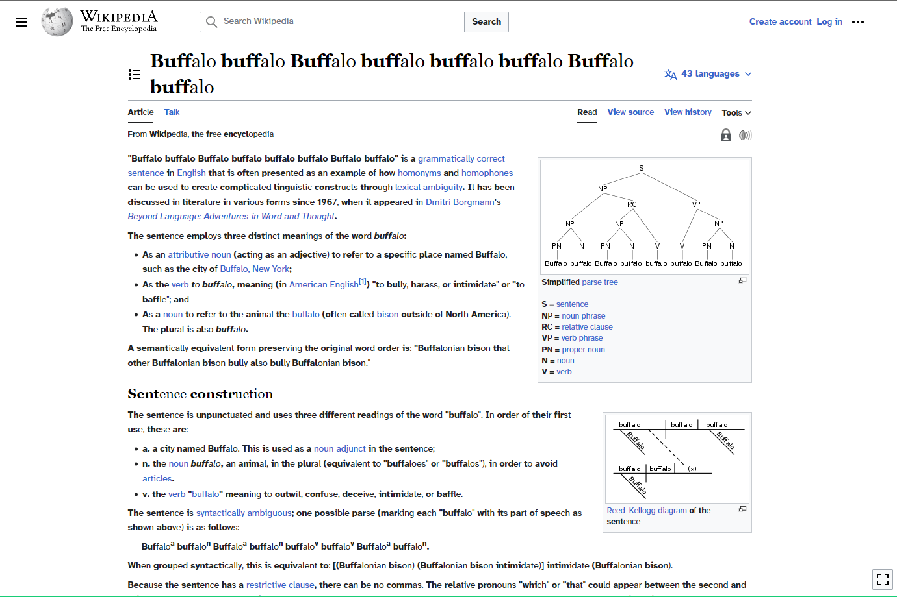

# read gooder

readgood.user.js ([Install](https://github.com/traviscampbell/readgood/raw/main/readgood.user.js) | [Source](https://github.com/traviscampbell/readgood/blob/main/readgood.user.js))

User script to help you learn how read good and to do other stuff good too. It's my take on [Bionic Reading](https://bionic-reading.com/), except free and currently available as a userscript.

It's supposed to help with speed reading and focus especially for those with ADHD.

NOTE: Intended to be used with a UserScript manager such as: [GreaseMonkey](https://github.com/greasemonkey/greasemonkey), [TamperMonkey](https://github.com/Tampermonkey/tampermonkey), or [ViolentMonkey](https://github.com/violentmonkey/violentmonkey)

### Screenshot:

